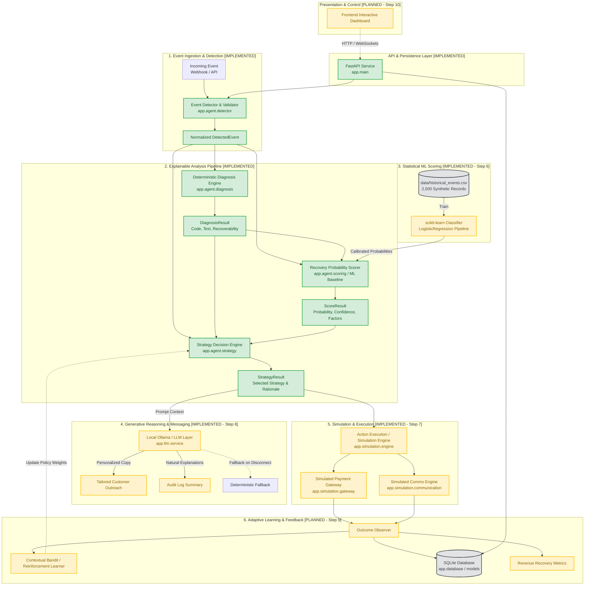

# AI Revenue Recovery Agent — Architecture Specification

## 1. Executive Overview

The **AI Revenue Recovery Agent** is an autonomous, hybrid decision-making system designed to mitigate revenue loss in digital commerce and subscription businesses. When transaction failures, cart drop-offs, or subscription billing issues occur, the platform analyzes the event in real time, diagnoses root causes, scores recovery likelihood, selects an optimal strategy, orchestrates customer interventions, observes resulting outcomes, and continuously learns to optimize recovery rates.

The platform follows a strict 9-stage lifecycle:
```
EVENT → DETECT → DIAGNOSE → SCORE → CHOOSE STRATEGY → EXECUTE → OBSERVE → LEARN → MEASURE
```

---

## 2. High-Level System Architecture

The platform combines deterministic business logic, statistical machine learning, generative language models (LLM), and reinforcement learning into an integrated architecture.



---

## 3. Implementation Status Matrix

| Component | Status | Details |
|---|---|---|
| **FastAPI Core (`backend/app/main.py`)** | **IMPLEMENTED** | App lifecycle, CORS/config, `/health`, and `/recovery/analyze` endpoints. |
| **Persistence (`backend/app/models.py`)** | **IMPLEMENTED** | SQLite with SQLAlchemy models for `Customer`, `RecoveryCase`, `Event`, and `Action`. |
| **Synthetic Dataset (`data/historical_events.csv`)** | **IMPLEMENTED** | 2,500 consistent historical events across 3 failure domains. |
| **Event Detection (`backend/app/agent/detector.py`)** | **IMPLEMENTED** | Validates `payment_failure`, `checkout_abandonment`, `subscription_failure`. |
| **Deterministic Diagnosis (`backend/app/agent/diagnosis.py`)** | **IMPLEMENTED** | Rule-based root cause diagnosis & recoverability assessment. |
| **Baseline Scoring (`backend/app/agent/scoring.py`)** | **IMPLEMENTED** | Deterministic explainable scoring with confidence (`LOW`/`MEDIUM`/`HIGH`). |
| **Strategy Engine (`backend/app/agent/strategy.py`)** | **IMPLEMENTED** | Rule-based selector across 7 distinct operational strategies. |
| **Agent Orchestrator (`backend/app/agent/orchestrator.py`)** | **IMPLEMENTED** | Coordinates `detect → diagnose → score → choose_strategy`. |
| **Machine Learning Model** | *PLANNED (Step 6)* | scikit-learn classifier trained on historical dataset for predictive recovery probability. |
| **Simulation Engine** | *PLANNED (Step 7)* | Safe virtual execution environment for retries, gateways, and messaging. |
| **LLM Reasoning & Messaging** | *PLANNED (Step 8)* | Ollama/local LLM integration for dynamic explanation and customer copy generation. |
| **Adaptive Learning / Bandit** | *PLANNED (Step 9)* | Contextual bandit exploration/exploitation for retry delays and strategy tuning. |
| **Frontend UI / Dashboard** | *PLANNED (Step 10)* | Real-time interactive UI demonstrating 5-minute recovery workflows. |

---

## 4. End-to-End Product Lifecycle

```
[1. EVENT] ──► [2. DETECT] ──► [3. DIAGNOSE] ──► [4. SCORE] ──► [5. CHOOSE STRATEGY]
                                                                        │
[9. MEASURE] ◄── [8. LEARN] ◄── [7. OBSERVE] ◄── [6. EXECUTE] ◄────────┘
```

### Stage 1: EVENT (Ingestion)
External trigger received via API/webhook representing revenue leakage:
- Payment processor decline (`payment_failure`)
- Cart drop-off at checkout step (`checkout_abandonment`)
- Recurring billing failure (`subscription_failure`)

### Stage 2: DETECT (Validation & Normalization) — *[IMPLEMENTED]*
The [`detector.py`](file:///c:/Users/Hardik/Desktop/AI-Revenue-Recovery-Agent/backend/app/agent/detector.py) module standardizes payloads into a typed [`DetectedEvent`](file:///c:/Users/Hardik/Desktop/AI-Revenue-Recovery-Agent/backend/app/agent/schemas.py#L49), validating domain constraints, negative values, and event categories.

### Stage 3: DIAGNOSE (Root Cause Analysis) — *[IMPLEMENTED]*
The [`diagnosis.py`](file:///c:/Users/Hardik/Desktop/AI-Revenue-Recovery-Agent/backend/app/agent/diagnosis.py) module evaluates error codes, customer interaction history, and contextual parameters to determine:
- `diagnosis_code` (e.g., `temporary_payment_issue`, `insufficient_funds`, `expired_card`, `fraud_hold`)
- `recoverability` (`recoverable`, `potentially_recoverable`, `unlikely`)
- Plain-English diagnostic rationale.

### Stage 4: SCORE (Recovery Probability) — *[CURRENT: Baseline Scorer / UPCOMING: ML Classifier]*
- **Current**: Deterministic transparent scoring in [`scoring.py`](file:///c:/Users/Hardik/Desktop/AI-Revenue-Recovery-Agent/backend/app/agent/scoring.py) combining weighted base rates, past successes/failures, amounts, and decline categories into a probability $\in [0.0, 1.0]$ and confidence rating (`LOW`, `MEDIUM`, `HIGH`).
- **Planned (Step 6)**: Calibrated scikit-learn model trained on `data/historical_events.csv` to output data-driven probabilistic predictions.

### Stage 5: CHOOSE STRATEGY (Action Selection) — *[IMPLEMENTED]*
The [`strategy.py`](file:///c:/Users/Hardik/Desktop/AI-Revenue-Recovery-Agent/backend/app/agent/strategy.py) module maps event context, diagnosis, and score to one of 7 standardized operational actions:
1. `retry_now`
2. `retry_later`
3. `request_alternate_payment`
4. `send_checkout_reminder`
5. `send_subscription_update_request`
6. `escalate_to_manual_review`
7. `do_nothing`

### Stage 6: EXECUTE (Orchestrated Action) — *[PLANNED - Step 7]*
Virtual simulation dispatcher executing the chosen strategy against safe sandbox payment processors and notification mocks without real-world side effects.

### Stage 7: OBSERVE (Outcome Tracking) — *[PLANNED - Step 7]*
Monitors the result of the dispatched action (e.g., payment success/failure, customer click, card update, timeout) and logs state transitions in SQLite.

### Stage 8: LEARN (Adaptive Optimization) — *[PLANNED - Step 9]*
Feedback loop using reinforcement learning / multi-armed bandits to adjust exploration policies, optimal delay timings, and channel preferences over time.

### Stage 9: MEASURE (Financial Attribution) — *[PLANNED - Step 9/10]*
Calculates recovered revenue vs. lost revenue, success rates by channel and failure type, and presents ROI metrics on the dashboard.

---

## 5. Multi-Agent Development Protocol

Development is coordinated between multiple AI coding agents (**Cursor** and **Antigravity**) adhering to the shared protocol established in [AGENTS.md](file:///c:/Users/Hardik/Desktop/AI-Revenue-Recovery-Agent/AGENTS.md):

1. **Project Directory as Single Source of Truth**: Agents do not rely on conversational context; all status is persisted in the repository.
2. **State & Task Tracking**:
   - [`.agent/STATE.md`](file:///c:/Users/Hardik/Desktop/AI-Revenue-Recovery-Agent/.agent/STATE.md): Current active phase and completed milestones.
   - [`.agent/TASKS.md`](file:///c:/Users/Hardik/Desktop/AI-Revenue-Recovery-Agent/.agent/TASKS.md): Prioritized implementation backlog.
   - [`.agent/HANDOFF.md`](file:///c:/Users/Hardik/Desktop/AI-Revenue-Recovery-Agent/.agent/HANDOFF.md): Structured transfer of responsibility between agents.
   - [`.agent/AGENT_STATUS.json`](file:///c:/Users/Hardik/Desktop/AI-Revenue-Recovery-Agent/.agent/AGENT_STATUS.json): Machine-readable execution state.
   - [`.agent/DECISIONS.md`](file:///c:/Users/Hardik/Desktop/AI-Revenue-Recovery-Agent/.agent/DECISIONS.md): Architectural decisions and invariants.
   - [`.agent/CHANGELOG.md`](file:///c:/Users/Hardik/Desktop/AI-Revenue-Recovery-Agent/.agent/CHANGELOG.md): Incremental release history.
3. **Sequential Ownership**: Only one development agent modifies codebase files at a given time. When usage constraints occur, a clean handoff is documented.
4. **Git Checkpointing**: Regular, descriptive commits capture functional milestones.
