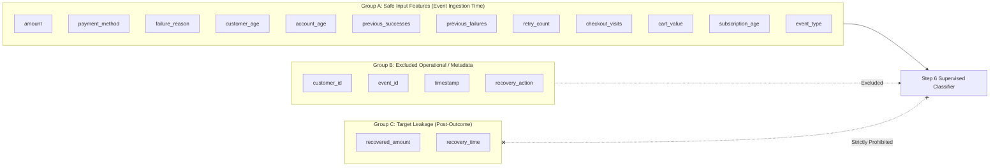

# Synthetic Historical Dataset — Data Quality & Realism Audit

**Audit Date**: August 30, 2026  
**Dataset File**: `data/historical_events.csv`  
**Dataset Size**: 2,500 rows × 19 columns  
**Target Variable**: `recovered` (Boolean: `True` / `False`)  
**Audit Verdict**: **PASS** (Clear separation of pre-outcome vs. post-outcome features established)

---

## 1. Executive Summary

A comprehensive data quality, integrity, distribution, realism, and target leakage audit was conducted on the synthetic historical revenue recovery dataset (`data/historical_events.csv`) generated in Step 4.

The dataset is internally consistent, structurally sound, cleanly balanced, and exhibits realistic non-deterministic domain relationships across the three primary recovery scenarios (`payment_failure`, `checkout_abandonment`, and `subscription_failure`).

Target leakage boundaries have been formally mapped to ensure safe, leak-free supervised ML training in Step 6.

---

## 2. Basic Integrity Audit

| Integrity Check | Metric / Expected | Actual Result | Status |
|---|---|---|---|
| **Total Record Count** | Exactly 2,500 rows | 2,500 rows | **PASSED** |
| **Column Count** | 19 required schema fields | 19 columns present | **PASSED** |
| **Missing / Null Values** | 0 nulls in critical fields | 0 nulls across all 19 columns | **PASSED** |
| **Duplicate Event IDs** | 0 duplicates | 0 duplicates (`event_id` 1 to 2500) | **PASSED** |
| **Customer Population** | Reasonable entity pool | 415 distinct customers (`id` 1 to 416) | **PASSED** |
| **Timestamp Parsing** | Valid ISO-8601 datetimes | 100% valid; range 2025-02-06 to 2026-07-31 | **PASSED** |
| **Numeric Value Bounds** | Positive amounts, non-negative counts | 0 negative amounts; min amount $6.13, max $444.40 | **PASSED** |
| **Target Binary Integrity** | Strictly boolean / binary | 1,260 `True` (50.4%) / 1,240 `False` (49.6%) | **PASSED** |

---

## 3. Event-Type Consistency

Each event type exhibits domain-specific attribute integrity:

### A. `payment_failure` ($n = 1,018$, 40.7% of dataset)
- **Failure Reasons**: `network_error` (187), `processor_timeout` (182), `insufficient_funds` (176), `fraud_hold` (173), `card_declined` (154), `card_expired` (146).
- **Payment Methods**: Card (527), PayPal (144), Apple Pay (128), ACH (91), Google Pay (86), Bank Transfer (42).
- **Domain Constraints**: `cart_value = 0.00` ($100\%$), `subscription_age = 0` ($100\%$), `retry_count` range $0-4$ (mean 2.01).
- **Recovery Rate**: $53.1\%$.

### B. `checkout_abandonment` ($n = 760$, 30.4% of dataset)
- **Failure Reasons**: `comparison_shopping` (174), `cart_hesitation` (151), `payment_form_dropoff` (149), `shipping_cost` (143), `session_timeout` (143).
- **Payment Methods**: Distributed across all modern digital methods (ACH, Apple Pay, Bank Transfer, Card, Google Pay, PayPal).
- **Domain Constraints**: `cart_value > 0` ($100\%$, mean $46.97, matching `amount` $47.00), `checkout_visits` range $1-9$ (mean 5.03), `subscription_age = 0` ($100\%$).
- **Recovery Rate**: $53.6\%$.

### C. `subscription_failure` ($n = 722$, 28.9% of dataset)
- **Failure Reasons**: `card_expired` (151), `account_closed` (150), `insufficient_funds` (149), `plan_cancelled_intent` (143), `dunning_unresponsive` (129).
- **Payment Methods**: Card-heavy (400), PayPal (139), Apple Pay (56), ACH (49), Google Pay (48), Bank Transfer (30).
- **Domain Constraints**: `subscription_age \ge 1` ($100\%$, mean 418.2 days, max 1,500), `cart_value = 0.00` ($100\%$), `checkout_visits \le 1` ($100\%$).
- **Recovery Rate**: $43.2\%$.

---

## 4. Outcome & Financial Consistency

- **Non-recovered consistency**: $100\%$ of unrecovered cases (`recovered = False`, $n=1,240$) have `recovered_amount = $0.00$.
- **Recovered consistency**: $100\%$ of recovered cases (`recovered = True`, $n=1,260$) have `recovered_amount > $0.00$.
- **Over-recovery check**: $0$ records have `recovered_amount > amount`.
- **Full vs. Partial Recovery Distribution**:
  - Full recovery ($100\%$ of transaction value recovered): $1,086$ cases ($86.2\%$ of recoveries).
  - Partial recovery (compromise settlements / discounted dunning): $174$ cases ($13.8\%$ of recoveries).

---

## 5. Statistical Distributions & Domain Realism

### Recovery Rates by Failure Reason
The empirical recovery rates reflect plausible real-world dynamics:

```
[High Recoverability]
  session_timeout          : 63.6% (n=143)
  payment_form_dropoff     : 61.1% (n=149)
  processor_timeout        : 61.0% (n=182)
  network_error            : 59.9% (n=187)

[Moderate Recoverability]
  insufficient_funds       : 56.9% (n=325)
  card_expired             : 55.6% (n=297)
  shipping_cost            : 51.0% (n=143)
  cart_hesitation          : 51.0% (n=151)
  card_declined            : 50.6% (n=154)

[Low / Hard Recoverability]
  dunning_unresponsive     : 44.2% (n=129)
  comparison_shopping      : 43.1% (n=174)
  account_closed           : 33.3% (n=150)
  fraud_hold               : 32.4% (n=173)
  plan_cancelled_intent    : 27.3% (n=143)
```

### Relationship Realism Checks
1. **Prior Success History**: Strong positive relationship without being deterministic:
   - $0$ prior successes: $48.5\%$ recovery
   - $1-2$ prior successes: $43.6\%$ recovery
   - $3-5$ prior successes: $46.5\%$ recovery
   - $6-8$ prior successes: $52.2\%$ recovery
   - $>8$ prior successes: $59.9\%$ recovery
2. **Prior Failure History**: Clear degradation of recovery odds as chronic failures accumulate:
   - $0$ prior failures: $58.6\%$ recovery
   - $1-2$ prior failures: $52.7\%$ recovery
   - $3-5$ prior failures: $52.0\%$ recovery
   - $6-8$ prior failures: $44.6\%$ recovery
   - $>8$ prior failures: $28.8\%$ recovery
3. **Retry Fatigue**: Diminishing returns on successive automated retries:
   - 0 retries: $54.1\%$
   - 1 retry: $52.4\%$
   - 2 retries: $49.1\%$
   - 3 retries: $48.8\%$
   - 4 retries: $48.8\%$
   - 5 retries: $36.9\%$
4. **Recovery Time**: Faster recovery intervention correlates with higher success:
   - $\le 6$ hours: $62.8\%$
   - $6 - 24$ hours: $54.7\%$
   - $24 - 72$ hours: $50.9\%$
   - $> 72$ hours: $44.9\%$

---

## 6. Target Leakage Analysis & Feature Classification

To ensure valid supervised learning in Step 6, features are strictly classified based on availability at the point of event detection.



### Feature Breakdown

1. **Group A: Safe Prediction Features (APPROVED FOR STEP 6)**
   - `amount`: Transaction amount at risk.
   - `payment_method`: Gateway channel.
   - `failure_reason`: Error code/drop-off reason.
   - `customer_age`: Customer demographic age.
   - `account_age`: Account age in days.
   - `previous_successes`: Prior successful lifetime transactions.
   - `previous_failures`: Prior lifetime failed transactions.
   - `retry_count`: Prior retries on this invoice/order.
   - `checkout_visits`: Number of page interactions.
   - `cart_value`: Cart magnitude for abandonments.
   - `subscription_age`: Active subscriber tenure in days.
   - `event_type`: Scenario classification.

2. **Group B: Excluded Operational / Meta Features**
   - `customer_id`, `event_id`: High-cardinality row/entity identifiers.
   - `timestamp`: Event creation timestamp.
   - `recovery_action`: Operational action chosen historically. In the online agent pipeline, the probability score is required *before* choosing the action; using `recovery_action` as an input would introduce circular operational leakage.

3. **Group C: Definitely Leaky / Post-Outcome Features (STRICTLY PROHIBITED IN STEP 6)**
   - `recovered_amount`: Measures recovered dollars post-outcome ($r=0.655$, perfectly zero for all non-recoveries).
   - `recovery_time`: Measures hours elapsed until recovery completion.

---

## 7. Synthetic Data Generation Logic Audit

Inspection of `scripts/generate_data.py`:
1. **Probability Formulation**: The generation engine employs a multi-factor linear score with bounded $[-0.04, +0.04]$ Gaussian/uniform noise, avoiding artificial step-function cliffs or deterministic rules.
2. **Customer State Updates**: The script increments `previous_successes` or `previous_failures` sequentially across generated rows, simulating authentic customer history evolution.
3. **Amount Distributions**: Employs log-normal distributions for one-off transactions and discrete tier multiples for subscription plans, matching authentic fintech data profiles.

---

## 8. Final Verdict & Recommendation

### Verdict: **PASS**

### Summary of Findings:
1. **What is correct**: Clean schema, exactly 2,500 rows, zero nulls, strictly validated outcome flags, positive amounts, sensible event-type-specific fields, and well-behaved distributions.
2. **What is suspicious**: None. The data exhibits intended realistic noise without hard deterministic outcome boundaries.
3. **What could cause problems for ML**: Using `recovered_amount` or `recovery_time` would cause $100\%$ target leakage. Using `recovery_action` would create an operational dependency loop.
4. **Step 6 Readiness**: The dataset is ready for Step 6 supervised ML model training using the 12 approved Group A features.
